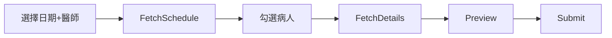

# Backend 開發指南

> 🤖 **AI 開發者注意**：本文檔設計用於讓 AI 模型快速理解後端架構，產生一致品質的程式碼。

> 📖 **相關文檔**：[README](../README.md) | [FRONTEND_GUIDE](../frontend/FRONTEND_GUIDE.md) | [LAUNCHER_GUIDE](../zbot_launcher/LAUNCHER_GUIDE.md) | [RELEASE_GUIDE](../RELEASE_GUIDE.md)

## 目錄

1. [Quick Reference](#quick-reference)
2. [架構總覽](#架構總覽)
3. [核心模組](#核心模組)
   - [vghsdk (底層爬蟲)](#vghsdk-底層爬蟲)
   - [app/tasks (業務任務)](#apptasks-業務任務)
   - [app/core (核心元件)](#appcore-核心元件)
4. [資料庫架構](#資料庫架構-supabase)
5. [API Router 概述](#api-router-概述)
6. [開發環境設置](#開發環境設置)
7. [測試指南](#測試指南)
8. [附錄: COL_* 欄位規範](#col-動態欄位命名準則)
9. [附錄: Surgery 資料流](#surgery-note-資料流分析)

---

## Quick Reference

```python
# 📌 應用層 Task (組合多個爬蟲 + 業務邏輯)
from app.tasks.base import BaseTask

# 📌 底層爬蟲 (單一資料來源抓取)
from vghsdk.core import CrawlerTask, VghClient

# 📌 Task 註冊
from app.core.registry import TaskRegistry
```

---

## 架構總覽

```
┌─────────────────────────────────────────────────────────────────┐
│  app/                                                            │
│  ├── main.py            → FastAPI 入口                          │
│  ├── routers/           → API 端點                               │
│  ├── core/              → JobManager, TaskRegistry, Logger       │
│  ├── tasks/             → 業務任務 (使用 vghsdk)                  │
│  │   └── opnote/        → 手術紀錄相關模組                        │
│  └── db/                → Supabase 連接與 Schema                  │
├─────────────────────────────────────────────────────────────────┤
│  vghsdk/  (獨立底層庫，可未來拆分為獨立 package)                  │
│  ├── core.py            → VghClient, VghSession, CrawlerTask     │
│  └── modules/           → 原始爬蟲函數                            │
│      ├── patient.py        fetch_patient_info 等                 │
│      ├── surgery.py        fetch_op_schedule 等                   │
│      └── ivi.py            fetch_ivi_schedule                     │
└─────────────────────────────────────────────────────────────────┘
```

| 層級 | 基類 | 職責 | progress_callback |
|------|------|------|-------------------|
| `app/tasks/` | `BaseTask` | 組合爬蟲 + 業務邏輯 | ✅ 支援 |
| `vghsdk/modules/` | `CrawlerTask` | 單一資料來源抓取 | ❌ 不需 |

---

## 核心模組

### vghsdk (底層爬蟲)

`vghsdk/core.py` 提供：

| 類別 | 功能 |
|------|------|
| `VghClient` | 統一 VGH 客戶端，處理 EIP/CKS 登入、`safe_request()` 自動重試 |
| `VghSession` | 低階 HTTP Session 管理 |
| `CrawlerTask` | 爬蟲任務抽象基類 |
| `CrawlerConfig` | 全域爬蟲設定 (rate limit, retry 參數) |

#### safe_request() 功能

```python
# 自動處理:
# - Rate limit (模擬人類操作)
# - 重試 + Exponential backoff
# - Session 過期自動重新登入
response = await client.safe_request("GET", url)
```

### app/tasks (業務任務)

| 檔案 | 任務 | 說明 |
|------|------|------|
| `note_ivi.py` | IviBatchSubmitTask | IVI 注射批次送出 |
| `note_surgery.py` | Surgery*Task | 手術紀錄四步驟流程 |
| `dashboard_bed.py` | DashboardBedTask | 待床追蹤更新 GSheet |
| `stats_fee.py` | StatsFeeTask | 費用碼績效統計 |
| `stats_op.py` | StatsOpTask | 手術量統計 |

#### BaseTask 範本

```python
from app.tasks.base import BaseTask
from vghsdk.core import VghClient

class MyTask(BaseTask):
    id = "my_task"
    name = "我的任務"
    description = "任務說明"
    params_model = MyTaskParams  # Pydantic model
    
    async def run(self, params, client: VghClient, progress_callback=None):
        # params 已是 Pydantic model (由 router 轉換)
        if progress_callback:
            await progress_callback(0, "開始執行")
        
        # 使用 safe_request 自動處理重試
        resp = await client.safe_request("GET", url)
        
        if progress_callback:
            await progress_callback(100, "完成")
        
        return MyTaskResult(status="success")

# 註冊
from app.core.registry import TaskRegistry
TaskRegistry.register(MyTask())
```

> [!IMPORTANT]
> **參數處理注意**: `params` 已經是 Pydantic model，不需要再解構 (`**params`)

### app/core (核心元件)

| 模組 | 功能 |
|------|------|
| `jobs.py` | `JobManager` - Job 狀態管理、Checkpoint 斷點續跑 |
| `registry.py` | `TaskRegistry` - Task 註冊中心 |
| `loader.py` | 啟動時載入所有 Tasks |
| `logger.py` | 統一日誌設定 |
| `alert.py` | Email 告警服務 |
| `task_logger.py` | 任務執行日誌 (寫入 DB) |

#### JobManager Checkpoint 支援

```python
from app.core.jobs import JobManager

# 設定總項目數
JobManager.set_total_items(job_id, total=10)

# 檢查是否已完成 (斷點續跑)
if JobManager.is_item_completed(job_id, key):
    continue

# 標記完成 (自動計算進度)
JobManager.mark_item_completed(job_id, key, message="處理中...")

# 檢查取消
if JobManager.is_cancelled(job_id):
    return
```

---

## 資料庫架構 (Supabase)

> **Schema 定義**: `backend/app/db/schema.sql`  
> 新部署時在 Supabase SQL Editor 中執行此檔案即可建立所有表。

### 資料表總覽

| 表名 | 用途 | RLS 讀 | RLS 寫 |
|-----|------|-------|--------|
| `users` | 使用者帳號 | 自己 | 自己 |
| `user_roles` | 使用者權限 | 自己 | ❌ Admin API |
| `settings` | 系統設定 (K-V JSON) | 全表 | ❌ Admin API |
| `op_templates` | 手術組套模板 | 全表 | ❌ Admin API |
| `doctor_sheets` | 醫師 GSheet 設定 | 全表 | 自己 |
| `task_logs` | 任務執行日誌 | Admin | Insert All |
| `task_stats` | 任務統計快取 | Admin | Service Role |

### 常用 settings 鍵值

| Key | 用途 |
|-----|------|
| `role_definitions` | 動態角色權限定義 |
| `stats_op_settings` | 手術統計 Sheet 設定 |
| `stats_fee_settings` | 費用碼統計 Sheet 設定 |
| `dashboard_bed_settings` | 待床追蹤 Sheet 設定 |
| `smtp_config` | Email 告警設定 |

### RPC 函數

| 函數 | 用途 |
|-----|------|
| `increment_task_stats(p_task_id, p_is_success, p_items, p_run_time)` | 原子更新統計 (避免並發 race condition) |

---

## API Router 概述

| Router | 路徑 | 說明 |
|--------|------|------|
| `auth.py` | `/api/auth/*` | 登入/登出、使用者驗證 |
| `tasks.py` | `/api/tasks/*` | 任務執行、Job 狀態查詢 |
| `sheets.py` | `/api/sheets/*` | GSheet 設定 CRUD |
| `templates.py` | `/api/templates/*` | 手術模板 CRUD |
| `stats.py` | `/api/stats/*` | 任務統計資料 |
| `report.py` | `/api/report/*` | 回報/升等功能 |
| `config.py` | `/api/config/*` | 環境設定 CRUD (含遮罩 Key 保護) |
| `frontend_error.py` | `/api/frontend-error` | 前端錯誤回報 |
| `system.py` | `/api/shutdown`, `/api/idle-status` | 伺服器管理（關閉、閒置狀態）|

### 公開端點

```python
GET /health          # 健康檢查
GET /api/status      # 系統狀態 (內網/DB 連線)
GET /api/test-supabase  # DB 連線測試
POST /api/shutdown   # 關閉伺服器 (僅限 localhost)
GET /api/idle-status # 閒置狀態查詢
```

---

## Server 生命週期管理

> 📖 **相關文檔**：[LAUNCHER_GUIDE](../zbot_launcher/LAUNCHER_GUIDE.md) - Launcher 端的實作細節

### 概述

Zbot Server 與 Launcher 之間有雙向健康監控機制，確保進程正確管理。

```
Launcher                              Server
   │                                    │
   │──── subprocess.Popen ────────────▶ │
   │                                    │
   │◀─── poll() 每 10s ────────────────│
   │     exit_code != 0 → 自動重啟      │
   │                                    │
   │                psutil.pid_exists() │◀── 每 5s
   │                Launcher 不見 → 自殺 │
```

> **Note**: 瀏覽器由 Server 啟動時自動開啟（`run_server.py`），Launcher 不負責開啟瀏覽器。這確保 URL/Port 設定集中管理，開發與生產環境行為一致。

### 自動關閉機制

| 機制 | 位置 | 說明 |
|------|------|------|
| **Idle Timeout** | `middleware/idle_tracker.py` | 30 分鐘無有意義活動自動關閉 |
| **PPID 監控** | `run_server.py` | 每 5 秒檢查 Launcher 是否存活 |
| **Shutdown API** | `routers/system.py` | `POST /api/shutdown` 優雅關閉 |

### Idle Timeout 排除路徑

以下路徑不會重置閒置計時器（視為輪詢而非真實活動）：

```python
EXCLUDED_PATHS = [
    "/api/tasks/jobs",   # 任務狀態輪詢
    "/api/status",       # 健康檢查
    "/health",           # 健康檢查
    "/favicon.ico",      # 瀏覽器請求
]
```

### Exit Code 約定

Server 與 Launcher 透過 Exit Code 溝通：

| Exit Code | 場景 | 觸發程式碼 | Launcher 行為 |
|-----------|------|-----------|--------------|
| **0** | Idle Timeout (30分鐘) | `os._exit(0)` | 退出 Launcher |
| **0** | POST /api/shutdown | `os._exit(0)` | 退出 Launcher |
| **0** | PPID 偵測 Launcher 不見 | `os._exit(0)` | N/A |
| **1** | 程式錯誤 | `sys.exit(1)` | 自動重啟 (最多 3 次) |
| **非 0** | 工作管理員強制終止 | N/A | 自動重啟 (最多 3 次) |

### 防止重複進程

Server 啟動時會檢查 Port 5487 是否已被佔用：

```python
# run_server.py
def is_port_in_use(port: int) -> bool:
    with socket.socket(socket.AF_INET, socket.SOCK_STREAM) as s:
        return s.connect_ex(('127.0.0.1', port)) == 0

if is_port_in_use(PORT):
    logger.warning("Port already in use, exiting...")
    sys.exit(0)
```

---

## 開發環境設置

### 環境需求

- Python 3.12 (透過 uv 自動管理)
- [uv](https://github.com/astral-sh/uv) 套件管理器

### 初始化

```bash
# 在專案根目錄執行 (使用 UV workspace)
cd Zbot

# 安裝 Python 3.12 (首次執行需要)
uv python install 3.12

# 安裝所有依賴
uv sync

# 此命令會安裝:
# - backend 所有依賴 (含最新 Supabase SDK)
# - zbot_launcher 依賴
# - 開發工具 (pyinstaller, pytest 等)
```

### 設定檔 (config.json)

首次啟動時，前端會顯示設定頁面讓使用者建立 `config.json`。

也可手動建立 `backend/config.json`：

```json
{
  "supabase_url": "https://xxx.supabase.co",
  "supabase_key": "eyJ...",
  "dev_mode": true,
  "log_level": "DEBUG",
  "test_eip_id": "DOC4050H",
  "test_eip_psw": "your_password"
}
```

| 欄位 | 說明 |
|------|------|
| `supabase_url` | Supabase 專案 URL |
| `supabase_key` | Supabase API Key |
| `dev_mode` | 開發模式 - 不實際送出資料到內網 |
| `log_level` | 日誌等級 (DEBUG/INFO/WARNING/ERROR) |
| `test_eip_id/psw` | 測試用 EIP 帳密 (可選) |

### 啟動開發伺服器

```bash
# 從根目錄執行
uv run uvicorn app.main:app --reload --port 5487 --app-dir backend
```

---

## 測試指南

### 測試結構

```
tests/
├── conftest.py          # 共用 fixtures
├── unit/                # 單元測試 (不需真實帳號)
│   ├── test_models.py
│   ├── test_opnote.py
│   └── test_registry.py
└── integration/         # 整合測試 (需 EIP 帳號)
    ├── test_login.py
    └── test_tasks.py
```

### 執行測試

```bash
# 單元測試
uv run pytest tests/unit -v

# 整合測試 (需設定環境變數)
TEST_EIP_ID=xxx TEST_EIP_PSW=yyy uv run pytest tests/integration -v -m integration

# 全部測試
uv run pytest tests/ -v
```

### 新增測試

```python
# tests/unit/test_xxx.py
import pytest
from app.tasks.xxx import MyTask

def test_my_task_params():
    """測試參數驗證"""
    params = MyTaskParams(date="2024-01-01")
    assert params.date == "2024-01-01"

@pytest.mark.asyncio
async def test_my_task_run(mock_vgh_client):
    """測試任務執行 (使用 mock)"""
    task = MyTask()
    result = await task.run(params, mock_vgh_client)
    assert result.status == "success"
```

---

## COL_* 動態欄位命名準則

> [!IMPORTANT]
> 所有動態填充欄位都使用 `COL_*` 後綴 + 全大寫命名

| 位置 | 格式 | 範例 |
|-----|------|------|
| `op_templates.required_fields` | `["COL_IOL", "COL_FINAL"]` | 資料庫儲存 |
| `op_templates.optional_fields` | `["COL_TARGET", "COL_SN"]` | 資料庫儲存 |
| `op_templates.template` | `$COL_IOL`, `$COL_FINAL` | 模板佔位符 |
| `doctor_sheets.column_map` | `{"COL_IOL": "IOL", "COL_FINAL": "Final"}` | GSheet 欄位對應 |
| 前端顯示 | `IOL`, `Final`, `Target` | 無 COL_ 前綴 |

### 新增欄位流程 (無需改程式碼)

1. **op_templates 表**: 在 `required_fields` 或 `optional_fields` 加入 `COL_NEW_FIELD`
2. **doctor_sheets 表**: 在 `column_map` 加入 `{"COL_NEW_FIELD": "GSheet欄位名"}`
3. **op_templates.template**: 使用 `$COL_NEW_FIELD` 佔位符

---

## Surgery Note 資料流分析

### 概述

手術紀錄系統從 3 個資料來源取得資料，經過 4 個步驟處理後送出到 Web9。

### 資料來源

| 來源 | 資料類型 |
|------|----------|
| **內網排程** (SDK) | 手術科部、病房床號、主刀/助手、術前診斷 |
| **Web9** (Patient Form) | 病人基本資料、`sel_opck` (手術時段選擇) ★ |
| **GSheet 刀表** | IOL、Final、側別、op_type 等動態欄位 |

> [!IMPORTANT]
> **`sel_opck` 是唯一必須從 Web9 取得的欄位**，用於選擇病人當天的手術時段。

### 處理步驟



| 步驟 | Task | 輸入 | 輸出 |
|------|------|------|------|
| 1 | `SurgeryFetchScheduleTask` | date, doc_code | 排程表列表 |
| 2 | `SurgeryFetchDetailsTask` | 選中項目 | 病人詳情 + GSheet 資料 |
| 3 | `SurgeryPreviewTask` | 病人詳情 | Payload 預覽 |
| 4 | `SurgerySubmitTask` | 確認的 Payloads | 送出結果 |

### Payload 欄位來源

| 欄位群組 | 來源 |
|----------|------|
| 病人資料 (`name`, `sex`, `age`, `hisno`) | Web9 |
| 手術時段 (`sel_opck`, `bgntm`, `endtm`) | Web9 ★ |
| 排程資訊 (`sect`, `ward`, `antyp`) | 內網排程 |
| 醫師資訊 (`man`, `mann`, `ass1`, `ass1n`) | 內網排程 |
| 手術名稱 (`opanam1`, `opacod1`) | op_templates 表 |
| 術後診斷 (`diaga`) | 動態生成 |
| 手術內容 (`op2data`) | template + GSheet placeholders |

---

## 常見問題

### Q: 我的爬蟲應該放哪裡?

| 放 vghsdk/modules/ | 放 app/tasks/ |
|-------------------|---------------|
| ✅ 單純抓資料 | ✅ 組合多個資料來源 |
| ✅ 可被多處使用 | ✅ 需要業務邏輯處理 |
| ✅ 不涉及 GSheet/Web9 | ✅ 需要與外部系統互動 |

### Q: 如何取得 EIP Session?

```python
async def run(self, params: dict, client: VghClient, ...):
    session = client.session  # VghSession 物件
    
    # 發送請求
    resp = await session.get("https://...")
    resp = await session.post("https://...", data={...})
```

### Q: 如何讀取/寫入 Google Sheets?

```python
from app.core.config import get_settings
import pygsheets

# 使用 pygsheets (認證透過 service account)
settings = get_settings()
gc = pygsheets.authorize(service_file="path/to/creds.json")
sh = gc.open_by_key(sheet_id)
worksheet = sh.worksheet("Sheet1")

# 讀取資料
data = worksheet.get_all_values()

# 寫入資料
worksheet.update_values("A1", [["Value1", "Value2"]])
```

### Q: 如何從 Supabase 讀取設定?

```python
from app.supabase.client import get_supabase_client

client = get_supabase_client()
result = client.table("settings").select("*").eq("key", "my_key").execute()
settings = result.data[0] if result.data else None
```

### Q: 參數報錯 "argument after ** must be a mapping"

這是因為 params 已經是 Pydantic model，不需要再解構：

```python
# ❌ 錯誤
p = MyParams(**params)

# ✅ 正確
p = params
```

### Q: Task 沒有被註冊?

1. 確認檔案底部有 `TaskRegistry.register(MyTask())`
2. 確認 `app/core/loader.py` 有 import 該模組

